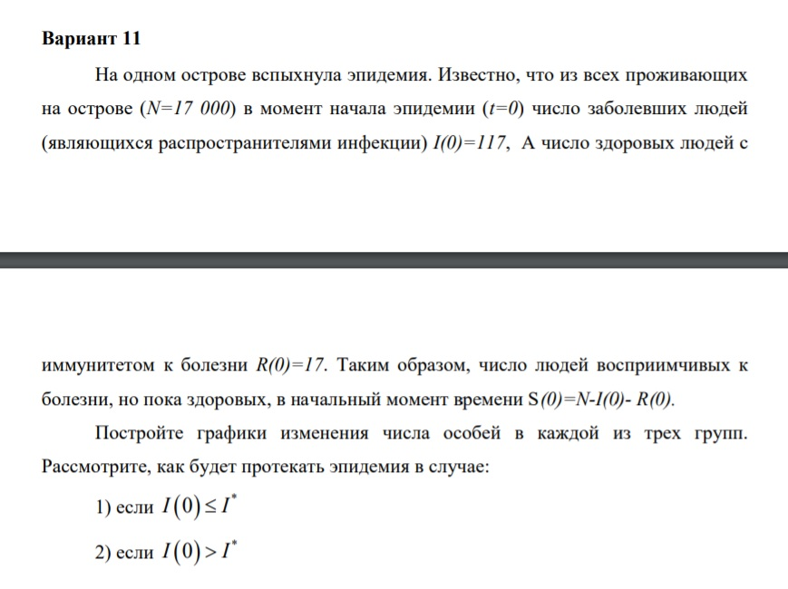
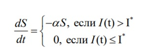
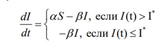
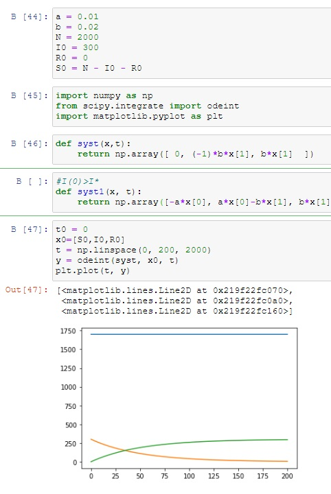
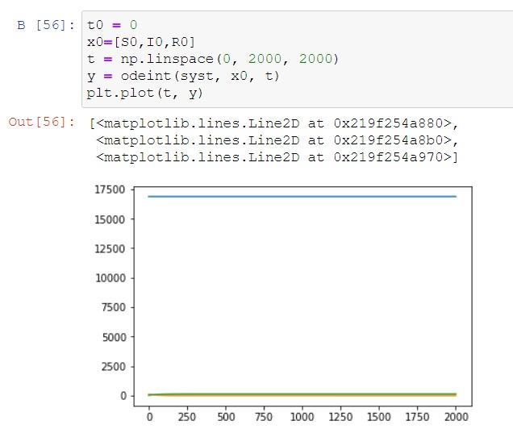
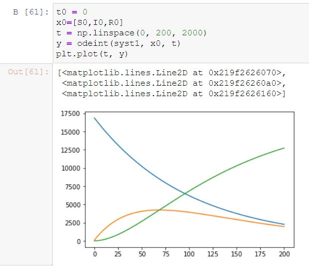

---
## Front matter
lang: ru-RU
title: Structural approach to the deep learning method
author: |
	Kuchenov I.V\inst{1,3}

## Formatting
toc: false
slide_level: 2
theme: metropolis
header-includes:
 - \metroset{progressbar=frametitle,sectionpage=progressbar,numbering=fraction}
 - '\makeatletter'
 - '\beamer@ignorenonframefalse'
 - '\makeatother'
aspectratio: 43
section-titles: true
---

# Модель пандемии

## Постановка задачи

## Цель

Цель - Постройте графики изменения числа особей в каждой из трех групп.

### Теоретическая часть:

1. Теоретическая часть.

Предположим, что некая популяция, состоящая из N особей, (считаем, что популяция изолирована) подразделяется на три группы. Первая группа - это восприимчивые к болезни, но пока здоровые особи, обозначим их через S(t). Вторая группа – это число инфицированных особей, которые также при этом являются распространителями инфекции, обозначим их I(t). А третья группа, обозначающаяся через R(t) – это здоровые особи с иммунитетом к болезни.

Таким образом, скорость изменения числа S(t) меняется по следующему
закону:

Поскольку каждая восприимчивая к болезни особь, которая, в конце концов,
заболевает, сама становится инфекционной, то скорость изменения числа
инфекционных особей представляет разность за единицу времени между
заразившимися и теми, кто уже болеет и лечится, т.е.:

# Ход решения

Мои значения:

Код:

Построение графиков:
Графики:

Первый график:

Второй график:

# Выводы
Результат: Постройте графики изменения числа особей в каждой из трех групп и увидели как будет вести себя популяция на графиках.

Вывод: Построили математическую модель, использовали python, выявили результаты для двух случаев, научились строить математическую модель для нахождения исхода и результатов.
